#	Re:從零開始的 `HTML` 生活
對，今天要教的是HTML  

#	What is HTML?
`HTML`是一種用於設計網頁的程式語言。  
時間關係，我們不會把所有`HTML`的功能教完，有興趣的同學可以自行上[W3Schools](https://www.w3schools.com/html/default.asp)學習。  
這個網頁建議好好做，可以放 ***學習歷程***  
[不知道是哪個怪人直接用HTML肝作業，還順便放學習歷程](https://kagariet01.github.io/blog/?p=h7)  

# How to start?
首先，先註冊[repl.it](https://replit.com/signup)  
點`Continue with Google`  
接者登入你的Google帳號  
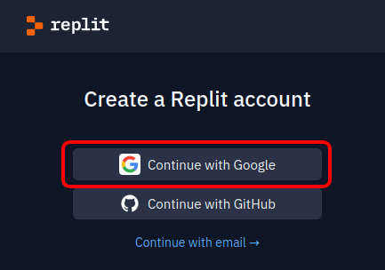  
再來就是填一些奇怪的東西  

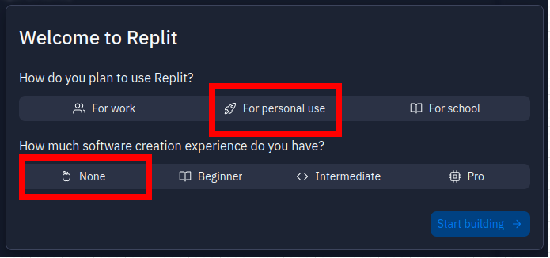  
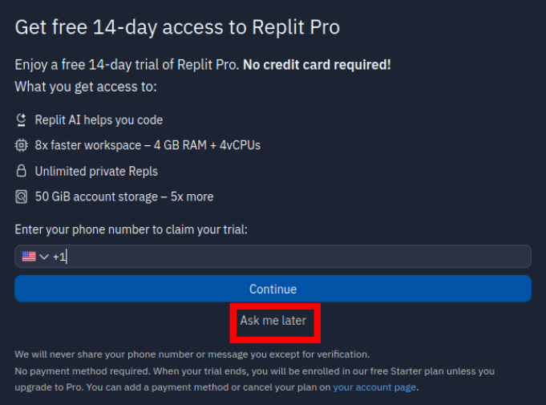  
再來選擇HTML,CSS,JS  
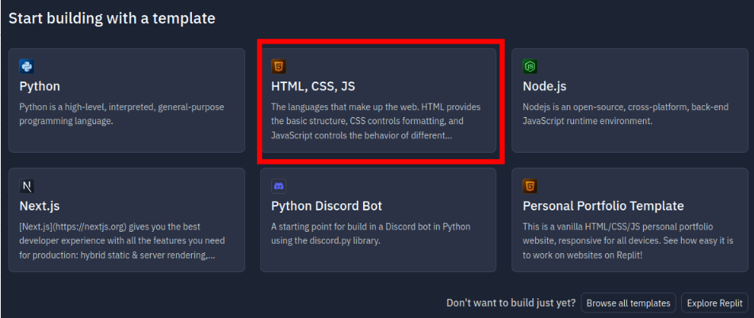  
填寫你的專案名稱(ex:`web`)  
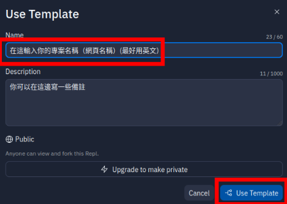  
這樣就算建立好一個網頁空間了  

# Something About `repl.it` 
> 工欲善其事，必先知其器  
> 《論語·沒有記載》  

p.s. 尼可以把它當成網頁版的VS code

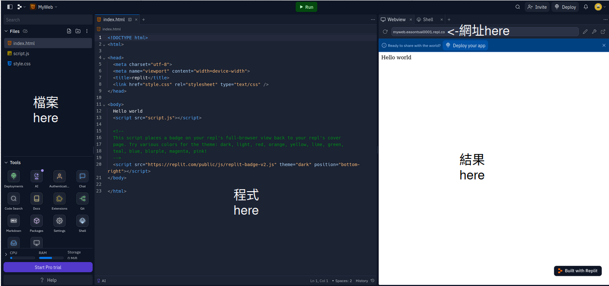  
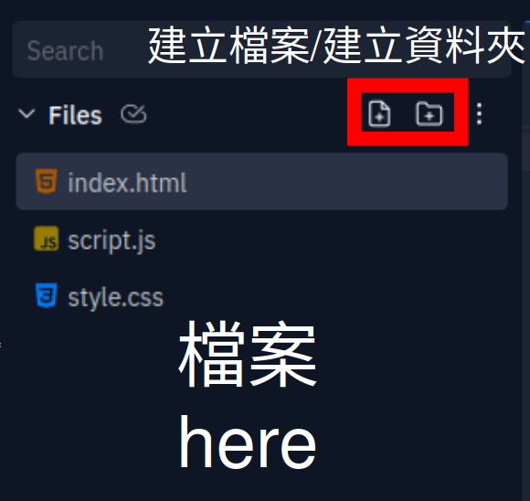  
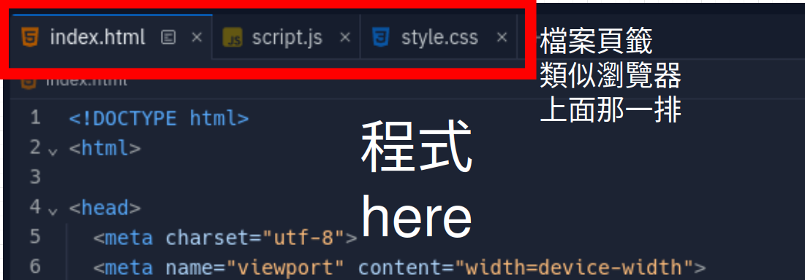  
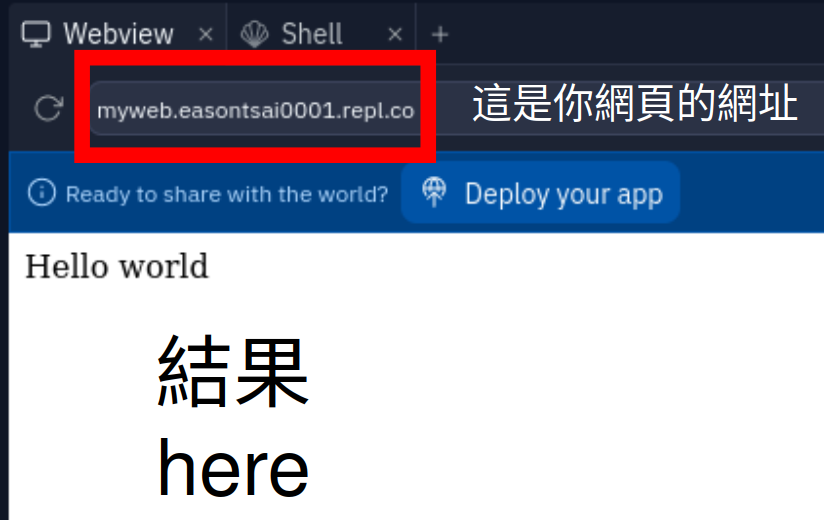  
辣個網址就是尼的成品的連結  
尼可以把辣個網址分享給尼的朋友  
當然，尼可以在新分頁中開啟辣個網址  
p.s. 檔案會自動儲存，不用按[`Ctrl`] + [`S`]  

# `HTML` 基礎模板
既然要從零開始，那請先把尼的`index.html`裡面的code刪掉  
並嘗試輸入下面的基礎模板  
p.s. 可以看著抄，但不建議複製貼上
```html
<!DOCTYPE html>
<html>
	<head>
	</head>

	<body>
	</body>
</html>
```
`html`的基礎結構如下：
```html
<tagname_here>something here</tagname_here>
```
你可以把`<tagname_here>`視為左括號`(`  
`</tagname_here>`視為右括號`)`  
你可以把`<tagname_here></tagname_here>`當作一個箱子，裡面可以放方塊、箱子...  
`tagname_here`代表裡面包的東西的種類(ex:`p`表內文,`h1`表標題)  
ex: `body`包主程式，`head`包網站設定  
所以上面的程式碼可以這樣理解  
```txt
<!DOCTYPE html>
(
	(
	)

	(
	)
)
```
而最上面的`<!DOCTYPE html>`只是用來標示這份檔案使用的程式語言  
這一行很重要，別忘記加 ~~，因為電腦很笨，它通靈不出尼想寫的程式語言~~  
and now `let you try try`  

# `Title` 抬頭
在開始打網頁之前，我們先抬頭看一下  
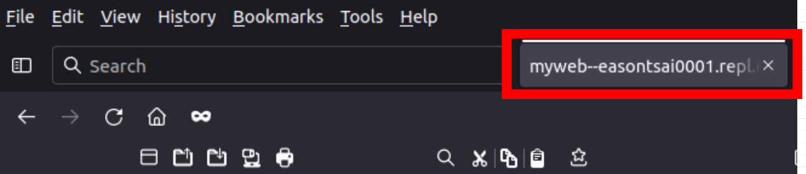  
`myweb--easontsai0001.repl.co` 這標籤有夠丑  
我們可以用`<title>`來設定我們的抬頭標籤  
```html
<html>
	<head>
		<title>標籤名稱</title>
	</head>
</html>
```
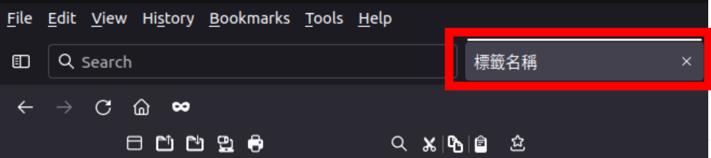  
好看多了  
***注意， `Title` 對 `HTML` 來說算是一種設定，請放入 `<head> </head>` 裡面***  
and now `let you try try`

# Favicon
當你再次抬頭的時候，尼會發現，窩們的網頁還沒有icon  
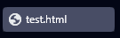  
我們使用`<link rel="icon" href="網址here">`來新增icon  
此行程式碼不用尾元素`</link>`，因為它裡面不能放東西  
此行程式碼也是要放在`<head></head>`裡面
而在 `link` 後面的東西叫做屬性  
```html
<link 
	rel="icon"            note="設定這東西要是icon"
	href="網址here"        note="設定icon檔案的位置"
>
```
而`網址here`則是填網路上的圖片URL，或是同個資料夾中，圖片的檔名  
例如：我把圖片和`index放在同一個資料夾裡`  
> `(root)`  
>> `index.html`  
>> `image.png`  

則我可以在`網址here`放入`image.png`  
```html
<!DOCTYPE html>
<html>
	<head>
		<link rel="icon" href="image.png">
		<title>ET01_web</title>
	</head>
</html>
```
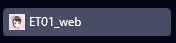  
p.s. 把該頁面加入書籤，書籤也會顯示該icon  
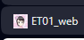  
p.s. 尼可以在 `檔案區` > `...` > `Update file` 上傳尼喜歡的圖片  
p.s. 使用圖片時，請注意版權  
***注意， `link icon` 對 `HTML` 來說算是一種設定，請放入 `<head> </head>` 裡面***  
and now `let you try try`  

# Hello World!
終於要來寫`Hello World!`了  
新元素：`<p></p>`代表段落，你可以在這裡面寫東西  
例如`<p>text here</p>`，網頁就會顯示`text here`  
```html
<!DOCTYPE html>
<html>
	<head>...</head>
	<body>
		<p>Hello World!</p>
	</body>
</html>
```
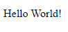  
p.s. 特殊字元(`<>&'"`)請參考[HTML的特殊字元](../HTML%20basic/HTML的特殊字元.md)  
***注意， `p` 對 `HTML` 來說算是一種顯示內容，請放入 `<body> </body>` 裡面，放在 `<head></head>` 會導致瀏覽器不顯示該內容***  
and now `let you try try`  
# 換行
有一行`Hello World!`了，現在就來5行`Hello World!`  
要在`HTML`換行，需要使用`<br>`（對應到`MD`裡的尾端雙空白）  
記住，`<br>`是單純一個元素而已，裡面不能包東西，所以沒有`</br>`  
你可以把它想像成一個方塊  
答案出來了  
```html
<!DOCTYPE html>
<html>
	<head>...</head>
	<body>
		<p>
			Hello World!<br>
			Hello World!<br>
			Hello World!<br>
			Hello World!<br>
			Hello World!
		</p>
	</body>
</html>
```
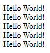  
and now `let you try try`  

# 縮排
在繼續深入教學前，我們先來美化我們的程式碼  
先來看看這個醜得要命的HTML程式碼  
```HTML
<!DOCTYPE html>
<html>
<head>
<title>標籤名稱</title>
<link rel="icon" href="網址here">
</head>
<body>
<p>
文字<br>
文字
</p>
<p>文字</p>
</body>
</html>
```
現在的程式碼還算短，但是當程式碼很長的時候，會變得難以閱讀  
我們可以說`HTML`就像箱子一樣，一個箱子包一個箱子，在程式碼也是一樣  
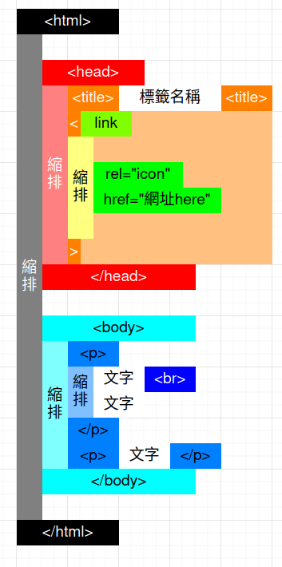  
我們可以按`[Tab]`鍵（縮排鍵）來製造一層一層的感覺，實現原始碼上的箱子包箱子  
所以剛剛的程式碼縮排後會變這樣  
講師的習慣：五行`Hello World!`有換行符號`<br>`，所以根據換行處進行換行  
如果只有一行文字，我通常會把它寫在一起，like`<p>txt here</p>`，當然你要寫成三行也可以  
其實縮排沒有硬性規定，怎麼開心怎麼來，前提是自己看得懂，還有不要胡亂縮排，甚至是不縮排  

```HTML
<!DOCTYPE html>
<html>
	<head>
		<title>標籤名稱</title>
		<link
			rel="icon"
			href="網址here"
		>
	</head>
	<body>
		<p>
			文字<br>
			文字
		</p>
		<p>文字</p>
	</body>
</html>
```
# 標題
使用`<h1></h1>`~`<h6></h6>`可新增標題  
對應`MD`裡的標題`#`  
```md
# <h1></h1>
## <h2></h2>
### <h3></h3>
#### <h4></h4>
##### <h5></h5>
###### <h6></h6>
####### 同樣沒有<h7></h7>
```
使用方法同`<p></p>`  
標題文字會加粗加大  
ex:  
```html
<!DOCTYPE html>
<html>
	<head>...</head>
	<body>
		<h1>HTML basic</h1>
		<h2>Hello World!</h2>
		<h3>Hello 尖叫ㄐ</h3>
		<h4>Hello 小ㄌㄌ</h4>
		<h5>Ststoneorz</h5>
		<h6>linlinorz</h6>
		<h7>和MD一樣，沒有h7</h7>
	</body>
</html>
```
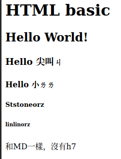  
and now `let you try try`  

# Note
寫註解，讓你可以更好理解自己寫的code  
使用`<!--Note here-->`撰寫註解  
Note here內的東西不會顯示  
建議可以用註解來寫你的`HTML`筆記  
```html
<!DOCTYPE html>
<html>
	<head><!--網頁設定，樣式...-->
		<title>標籤名稱</title><!--網頁標籤名稱-->
		<link rel="icon" href="little_loli.png"><!--網頁icon-->
	</head>

	<body><!--HTML 頁面顯示的東西-->
		<h1>HTML basic</h1><!--標題-->
		<p>HTML basic</p><!--內文、段落-->
	</body>

</html>
```
and now `let you try try`  

# 超連結
要在`HTML`裡插入連結，不能直接貼網址  
電腦很笨，如果你沒特別說明，他不會知道那是網址，尼也點不開  
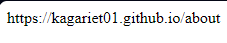  
在`HTML`，使用`<a></a>`插入連結  
```html
<a
	href="https://你的連結.here"
>
任何東西here
</a>
```
例如  
```html
<html>
	<head>...	</head>
	<body>
		<p>
			我最喜歡的歌： <a href="https://youtu.be/dQw4w9WgXcQ">點我跳轉</a> <br>
			<a href="https://youtu.be/dQw4w9WgXcQ">https://youtu.be/Ci_zad39Uhw</a>
		</p>
	</body>
</html>
```
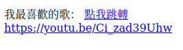  
點擊`點我跳轉`，就會跳轉到我最喜歡的歌  
當然，點下面的網址也可以  
你也可以文字放a連結，`href`放令一個連結（我想這個特性要怎麼用不用我多說把）  
（p.s. 這個連結最好不要點）  
and now `let you try try`  


# 圖片
``代表圖片  
``同樣不用加尾元素`</img>`，因為在圖片(` </img>`)裡面放東西沒有任何意義  
``解構如下  
```html

```
下面比較`<a></a>`和``的差別  
|`<a></a>`|``|
|:-:|:-:|
|需要尾元素|不需要|
|設定`href`屬性|設定`src`屬性|

（其實這個表格不用特別硬記，用久了就會了）  
（或者要用的時候問`Google`大電神）  
下面示範  
```html
<!DOCTYPE html>
<html>
	<head>...</head>
	
	<body>

		<p>
			這是一個很可愛的小ㄌㄌ<br>
			
			<br>
			
			這邊又有一個小ㄌㄌ<br>
			
			<br>

			阿，小ㄌㄌ被副社長抱走ㄌ
		</p>

	</body>
</html>
```
  
and now `let you try try`  

# 樣式
剛剛，我們看到的是白底黑字的亮色主題  
但現在，我們要將這個網頁改成黑底白字的暗色主題  
這邊有一個屬性：`style`樣式  
而style裡面可以設定背景色、排版、文字顏色、文字大小、字型...  
而`style`本身也是一種程式碼  
基礎的`style`程式碼  
```html
<tagname_here
	name="value"
	style="
		name: value;
		name2: value;
		name3: value;
	"
></tagname_here>
```
這邊有個例子  
```html
<!DOCTYPE html>
<html>

	<body>
		<p
			style="
				color: red;
			"
		>
			我是紅色的文字
		</p>
		<!---------------->
		<p
			style="
				color: #fff;
				background-color: #000000;
			"
		>
			我是黑底白字的文字
		</p>
	</body>

</html>
```
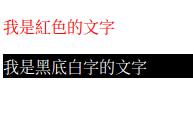  
p.s. 想改變背景顏色，可以在`<body>`裡新增`background-color`屬性  
而想要讓該行文字有熒光筆效果，可在`<p>`裡新增`background-color`屬性  
常用樣式整理表  
|程式|效果|
|:-:|:-:|
|color: `顏色`;|設定文字顏色|
|background-color: `顏色`;|設定背景顏色|
|font-size: `大小`;|設定文字大小|
|border: `大小` `樣式` `顏色`;|設定邊框|
|text-align: `文字對齊樣式`;|文字對齊|
|display: `顯示樣式`|顯示樣式（可以很複雜，下一章節會在多談）|
- `顏色`：
	- `#08f`(紅 綠 藍 0~F) 
	- `#02468ace`(紅紅 綠綠 藍藍 透明度 00~FF) 
	- `rgb(123,456,789)`(紅,綠,藍 0~255) 
	- `rgba(123,456,789,0.87)`(後面的小數為透明度 0~1)
- `大小`：`12px`  
- `文字對齊樣式`：`center`置中 `right`靠右 `left`靠左  
- `顯示樣式`：`block`預設顯示 `none`不顯示(這個東東在`JS`會用到)  
- `線條樣式`：`solid` 正常的線條 `double` 雙線條 `dashed` 虛線 `dotted` 點線  

這裡的可玩性太高了，可以自行上W3school上查看更多有趣的玩法  
預告：下一章節將介紹社長在製作網頁時使用到的屬性介紹  
like `shadow` `padding` `flex` `calc` `var` `clip-path` `font-family` `transition` ...

and now `let you try try`  

`[小ㄌㄌ]`~~水拉，又多一個學習歷程可以水~~  

# 參考資料
[HTML Tutorial](https://www.w3schools.com/html/default.asp)  
[replit](https://replit.com/)  
[border](https://developer.mozilla.org/zh-CN/docs/Web/CSS/border)  
[RAID](https://zh.wikipedia.org/zh-tw/RAID)  

p.s. 圖片皆為本人自己製作、螢幕截圖


# 欸，結束了也
那現在要幹麻？

# LICENSE
This work © 2023 by KagariET01 is licensed under CC BY-NC-SA 4.0. To view a copy of this license, visit <http://creativecommons.org/licenses/by-nc-sa/4.0/>  

</a>
